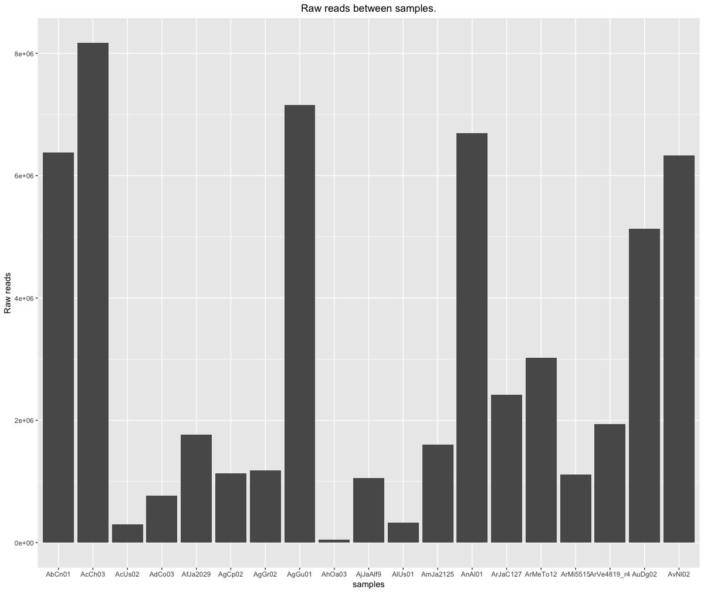

# Exploring the phylogenetic relationships in Abies genus using GBS data.
### Marco Garduño.

### Introduction.

Firs (Abies Miller; a predominantly temperate northern genus) are among the most abundant and less studied taxa, being distributed discontinuously in the temperate and subtropical montane forests of the northern hemisphere of Mesoamerica (i.e. Mexico and northern Central America) (Aguirre-Planter *et al*., 2011) Modern firs originated from the divergence of isolated mountain populations of migrating North American taxa. They are represented by eight threatened species, six of which are endemic to Mexico (Aguirre-Planter *et al*., 2011). They have been grouped into three or two different sections according to the most widely recognized classifications (i.e. Liu, 1971; Farjon and Rushforth, 1989.), which suggests at least two independent expansions from as many ancestors. 

 All phylogenies showed five main clusters that mostly agreed with the currently recognized sections of Abies and with the geographic distribution of species. However, populations of the same species were not monophyletic within this group. Genotyping-by-sequencing (GBS) has been developed as a low-cost approach for reduced representation sequencing and been demonstrated as a robust method for genome-wide profiling of complex populations (Mascher *et al*. 2013). The main goal of this project it was to explore de phylogenetic relationships of some of the most relevant firs species in Mexico and northern Central America, using GBS data, and put in contrast with previos infered phylogenetic relationship.   
 
### Materials and methods.

**Sampling of Firs species, DNA extraction and manipulation.**

Needles were collected from nineteen individuals of 19 *Abies* species in natural populations (table 1). Samples were obtained by the PhD Students Sebastian Arenas and Gustavo Ibrahim Giles Pérez. Total DNA was extracted from the needles using a cetyltrimethyl ammonium bromide (CTAB) mini-prep protocol (Vázquez-Lobo, 1996), or a DNeasy Plant Mini Kit (Qiagen).

**Table 1 *Abies* species sequenced using GBS.**

**Sequencing Method and sequence analysis**

The DNA Samples were sequenced with Ion Torrent In Illumina Plataform. Raw sequence reads were clustered *de novo* using Ipyrad (Eaton, D. A. R & Overcast, I., 2016). I perform 3 different runs, varying different parameters in order to obtanin the best posible aligment. In this Ensamble i used the mithocondrial genome of *Abies religiosa (GB code: MH612854.1 Abies religiosa voucher DRD45 plastid, complete genome)* in order to eliminate the mitochondrial sequences presented in each sample. Since the Data was demultiplexed previously, I chose those reads with enouhgt high sequencing quality in order to do the next steps (Figure 1). Just the better result it's presented in this report, and all the outputs can be found in my github repository (`https://github.com/Themindscupltor/ProyectoUnidad5MarcoG.git`)

**Figure 1 Frequency of raw reads in each sample.** 

**Phylogenetic reconstruction**

Using the loci ouptut data, I select the first 3 000 characters in order to make a phylogenetic reconstruction using RaxML-HPC2 with a GTR+I+G nucleotide substitution model. The reconstruction was made in CIPRES web portal, Using the parameters.txt file in RaxML Folder.

### Results and discussion.

**RAW data and clustering**

In the first steps using the demultiplexed sequences, we found that some specimens did not reach the one million readings scaffold (table 1), so I decided to eliminate them from the following steps. At the end of the assembly process with Ipyrad. the samples obtained a differential performance in regarding of the number of consensus readings (Figure 2). an the end of the ensamble processm i can recover an alignment with 66,443 SNPS (output: `prueba3.snps.phy.nex`, in the` step7` folder in this repository). 

**Figure 2. Consensus reads for all the samples used in the phylogenetic reconstruction**

**Phylogenetic reconstruction**

The phylogenetic reconstruction using the first 3000 bp of the output `test3.phy.nex` showed the topology in figure 1. To root the tree the sample was used ***AnAl01*** (*A. nordmanniana* from JB Koishikawa , Tokyo Japan). Since the taxonomic sampling used in this work is limited, the conclusions of this work have to be subedited to this condition. However, comparing the phylogeny obtained with that published in Aguirre-Planter *et al* (2011), we can observe certain similarities.

**Figure 3. ML phylogenetic reconstruction using RaxML-HPC2 for 15 *Abies* species. Bootstrap support are in black numbers over the branches.**

Enclosed in the yellow box, we can observe a group composed of those species from Mesoamerica and North America, similar to Group I, in the phylogeny of figure 2 in the article by Aguirre-Planter (2011). Within this group in my phylogenetic reconstruction, i obtainedlow bootstrap supports, and it is not possible to observe any biogeographical pattern that could explain the pattern of divergence between species, such as the effect of some geographic barrier (*i.e.* the transversal neovolcanic axis) as a factor encourage speciation by vicariance. 

**Figure 4 Fig. 2. Maximum-likelihood phylogenetic reconstruction of 33 Abies taxa inferred from three chloroplast markers (rbcL, rps18-rpl20, trnL-trnF. Aguirre-Planter *et al.*, 2011).**

 The separation on the phylogenetic tree of the samples **AbCn01** and **AnAl01** (*A. Balsamea* from Montreal, Canada and *A. nordmanniana* from Koishikawa, Japan) could recover groups III and IV, corresponding to North America and the Mediterranean groups in Aguirre-Planter (2011). However, the evolutionary relationships between the groups are not recovered in the same way as in the phylogeny of Aguirre-Planter *et al*. (2011). This could be explained as an artifact in the process of phylogenetic reconstruction, by not having used a greater number of taxa in order to better dilute the evolutionary relationships between the groups. Since the analyzes were carried out using only a fraction of the data obtained by the sequencing process, these may not be enough to recover a better phylogenetic reconstruction. With the help of a computational Cluster, it could be possible to run a greater amount of data, using a greater number of taxa, in order to obtain much more robust results.
 
 # Conclusions. 
 
 Even when the best possible result was not obtained, in this project it was possible to explore the evolutionary relationships of the main Abies species in Mexico and Central America using new generation sequences. The Ipyrad program offers a wide range of parameters to obtain a good resulting assembly. Although it was not the core of the work, it could be important to evaluate the impact of the parameters used for the de novo assembly, and to know how these parameters affect when carrying out the reconstruction. 
 
 # Ethics of this Job
 The dataset used in this job it's not of my own. Actually, his owner is Jorge Cruz, a master student of Juan Pablo Jaramilo-Correa, PhD investigator of Departamento de Ecología Evolutiva, Instituto de Ecología, Universidad Nacional Autónoma de México, Apartado Postal 70-275, México, D.F., Mexico. This data is unpublished, and the purpouse of use this data in this work its just academic. 
 
 ***References***

* Aguirre-Planter, É., Jaramillo-Correa, J. P., Gómez-Acevedo, S., Khasa, D. P., Bousquet, J., & Eguiarte, L. E. (2012). Phylogeny, diversification rates and species boundaries of Mesoamerican firs (Abies, Pinaceae) in a genus-wide context. Molecular Phylogenetics and Evolution, 62(1), 263-274.
* Eaton, D. A. R., & Overcast, I. (2016). ipyrad: interactive assembly and analysis of RADseq data sets.
* Farjon, A., & Rushforth, K. D. (1989). A classification of Abies Miller (Pinaceae). Notes Roy Bot Gard Edinburgh, 46(1), 59-79
* Liu, T. S. (1971). A monograph of the genus Abies. A monograph of the genus Abies.
* Mascher, M., Wu, S., Amand, P. S., Stein, N., & Poland, J. (2013). Application of genotyping-by-sequencing on semiconductor sequencing platforms: a comparison of genetic and reference-based marker ordering in barley. PloS one, 8(10), e76925.

